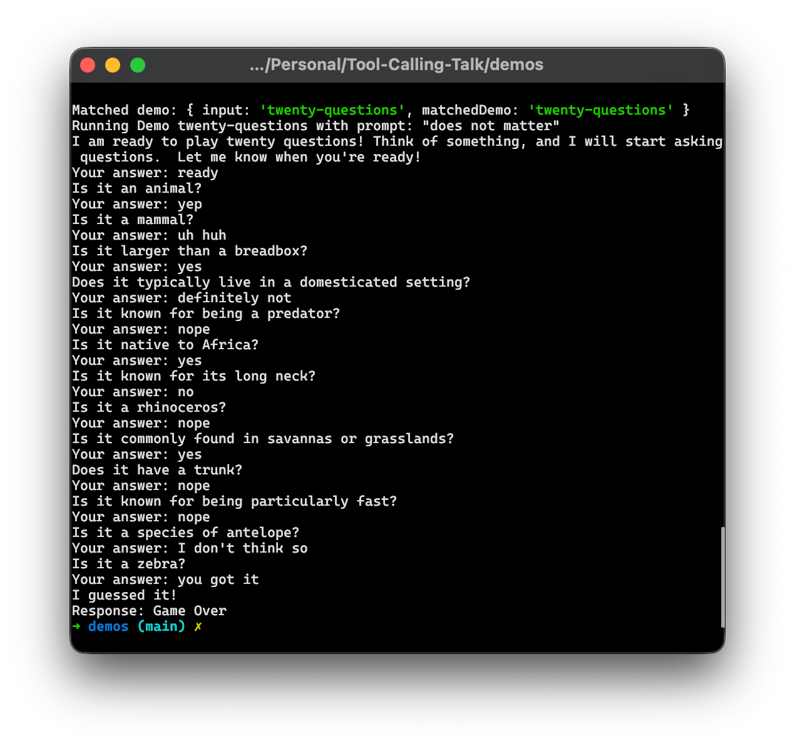
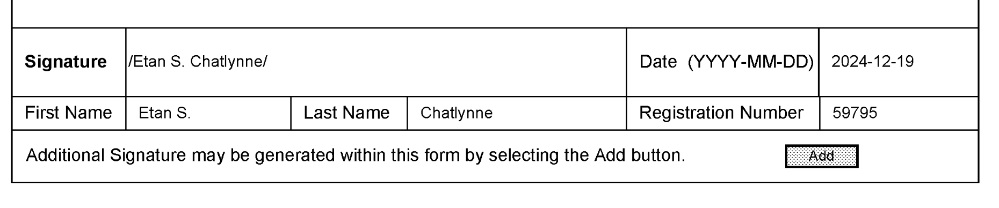
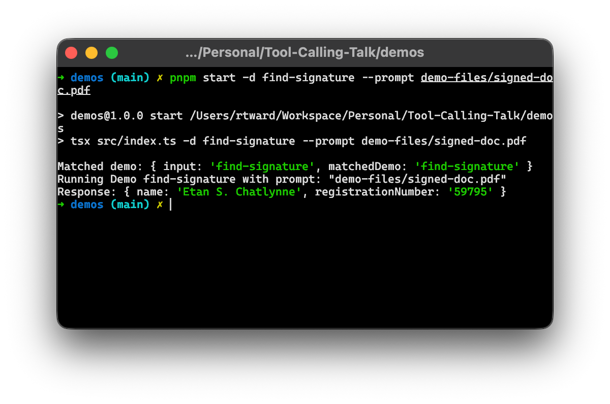
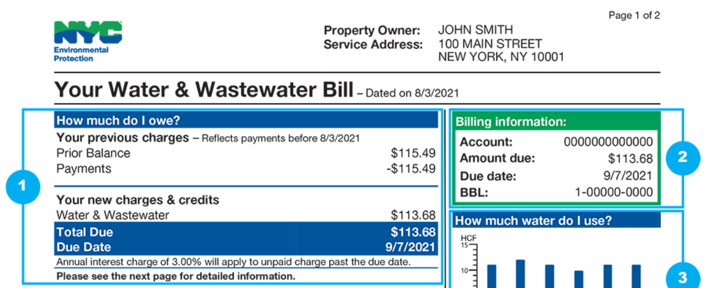
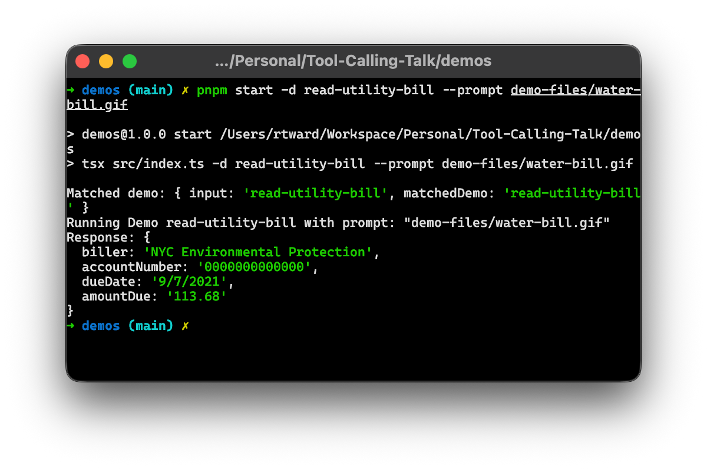
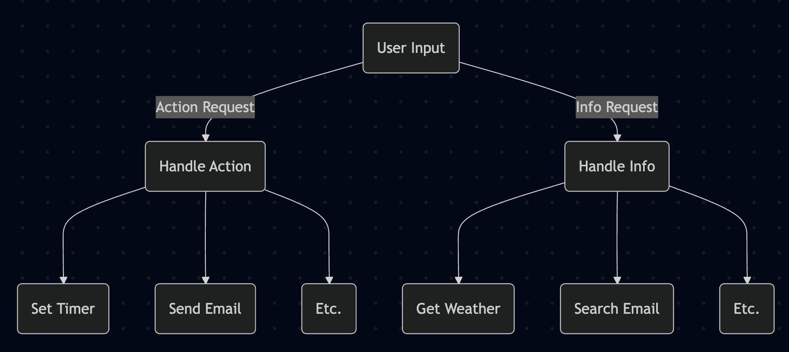
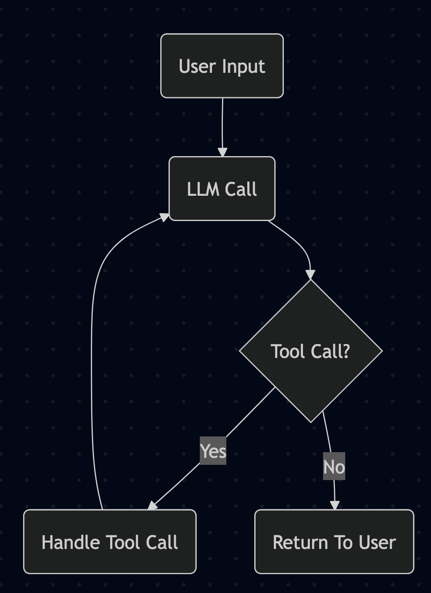

# TODOS
 - Fill out timings
 - Style Talk
 - Workflow

---

# LLM Tool Calling

## or

# Your computer's universal translator

---

# Who am I?

---

# Robert Ward

 * Co-founder of Arch Reactor Hackerspace
 * Co-founder of Juristat Inc.
 * Cub Scout Leader
 * Cargo Bike Enthusiast
 * Star Trek Fan
 * Playhouse Builder
 * 

<!-- 0:00 -->

---

# Bone-Fides

 * Several Time Phreaknic Speaker
 * Currently building AI products for the legal industry
   * For Accessing our Analytics Product
   * For Analyzing USPTO rejections
   * And Offering Suggestions Based on Past Performance

<!-- 0:30 -->

---

# A Confession
 
---

# A Confession

# I'm an AI Sceptic

<!-- 1:00 -->

<!--
I don't believe that LLMs are going to lead to superhumen intelligence, or even AGI (whatever that means)

I'm not even particularly impressed with the current tech for most use cases.
-->

---

# A Promise

---

# This Talk is my Work

<!-- 1:30 -->

<!--
This entire talk was written by me by hand
No AI was used to work on the content or the demos
-->

---

# My AI Story

<!-- 2:00 -->

---

# AI At Home 

 * Dissapointed with AI search
 * Dissapointed with AI assistants
 * Thrilled with transcription

<!--
Story about using Claude to inventory and make a shopping list
-->

---

# AI At Work

 * Pressured to use AI
 * Dissapointed with coding tools
 * Dissapointed with writing tools
 * Thrilled with data extraction

<!--
Story about reading spreadsheets
Complain about the USPTO / PDFs
-->

---

# What's the Common Thread?

<!-- 5:00 -->

---

# What's the Common Thread?

# AI is *Great* at Translation

<!--
Translation from the real world to computer readable
Not translation from english to japanese
-->

---

# Tool Calling

 * MCP Servers
 * Tool Calling
 * RAG 

<!-- 6:00 -->

<!--
So back to tool calling.

Tool calling is the buzzword

What it really is, is structured output
-->

---

# Structured Output

---

# Structured Output

## vs

# Regular Output

---

## Regular Output

> *user:* What's the Capital of Austria

> *assistant:* The capital city of Austria is Vienna

---

## Structured Output

> *user:* What's the Capital of Austria

> *assistant:* `{"country": "Austria", "capital": "Vienna"}`

---

# Demos!

<!--
Here are some demos of simple use cases for structured content
These demos are all using the OpenAI API with OpenRouter
-->

---

# Yes / No

```
	const yesNoSchema = z.object({
		an.enum(["yes", "maybe", "no"]).describe("The answer to the question"),
	});

	const response = await openRouter.chat.send({
		model: "google/gemini-2.5-flash",
		messages: [
			{
				role: "system",
				content: "Your job is to translate a response from a user into a simple 'yes', 'no', or 'maybe' answer.",
			},
			{
				role: "user",
				content: statement,
			},
		],
		responseFormat: {
			type: "json_schema",
			jsonSchema: {
				name: "YesOrNoResponse",
				schema: z.toJSONSchema(yesNoSchema),
			},
		},
	});
```

<!--
"Translating" a human response into a binary yes or no
-->

---

# Yes / No

<video height=500px src='images/yes-no-demo.mov'></video>

---

# 20 Questions



<!--
This isn't really part of the talk, I just thought it was a fun use case for the first demo
-->

---

# Document Parsing

<!--
Translating a document into a standardized machine readable format
Actually the thing that got me going on this kick
-->

---

# Document Parsing

```
	const response = await openai.chat.completions.create({
		model: "google/gemini-2.5-flash",
		messages: [
			{ role: "system", content: systemPrompt },
			{
				role: "user",
				content: [
					{
						type: "file",
						file: {
							filename: "document.pdf",
							file_id: "document.pdf",
							file_data: fileData,
						},
					},
				],
			},
		],
		response_format: {
			type: "json_schema",
			json_schema: {
				name: "SignatureExtractionResponse",
				schema: z.toJSONSchema(signatureExtractionSchema),
			},
		},
	});
```

---

# Document Parsing



---

# Document Parsing



---

# Document Parsing



---

# Document Parsing



---

# Personal Assistant

 - Decide intent
 - Find target
 - Decide action

<!--
The advantage of doing multiple levels of LLM calls is that you avoid having to put massive tool definitions into the context window.
This saves you both context and makes your output more accurate in my experience.
It does increase the cost and latency though.
Not going to post the code for this one because it's a lot and it looks much the same.
-->

---

# Personal Assistant



---

# Personal Assistant

<video height=500px src='images/assistant-demo.mov'></video>

---

# Tool Calling



<!--
So all of those demos were one way, we got some info out of an LLM and used it to do something for the user.
Tool calling closes that loop by letting us then send information back to the LLM.
-->

---

# Weather Demo

<video height=500px src='images/weather-bot-demo.mov'></video>

<!--
In this weather demo, I'm asking if I need a jacket for this trip I'm currently on.
It has access to a tool to get the weather, then interprets the result for me.
-->

---

# Tool Calling Formats

 * MCP
 * OpenAI
 * Bedrock

<!--
Basically all of these are based on the JSONSchema format.
-->

---

# MCP

<!--
MCP has evolved as one of the early frontrunners in tool calling.
The idea is a simple standard API that conforms to a standard format and allows an LLM to call both local and remote tools easily.
-->

 - TODO: MCP Server Code
 - TODO: MCP Client Code

---

# OpenAI

<!--
OpenAI supports MCP now, but also has some of their own ideas.
They've supported calling OpenAPI spec APIs as well.
IMO this spec can be too complex for simple LLMs to call, hasn't worked well in my experience.
OpenAI also has a native foramt for doing tool calls in their API, which is what I'm showing off here.
All of these demos were done using the OpenAI API, but talking to the OpenRouter LLM service.
-->

 - TODO: OpenAI Tool Calling

---

# Bedrock

<!--
Bedrock is an API only service by AWS that supports a ton of foundational models
-->

 - TODO: Bedrock Tool Calling

---

# Inspiration

 * Planning Tool
 * Home Automation
 * Personal Knowledge Base

<!-- 44:00 -->

<!--
Planning Tool: Have the LLM make a plan step by step, then you can run those steps independently or sequentially
Home Automation: Surprisingly easy to start playing around with building an Alexa type experience for Home Assistant
PKB: Store your documents and notes and let an LLM search them for you
-->

---

<!-- 45:00 -->

# That's all folks! / Questions?


https://github.com/rtward/LLM-Tool-Calling-as-Translator-Talk

Website: https://rtward.com/
Signal: `rtward.32`
Bluesky: `@rtward.com`
Mastodon: `@rtward@mastodon.social`